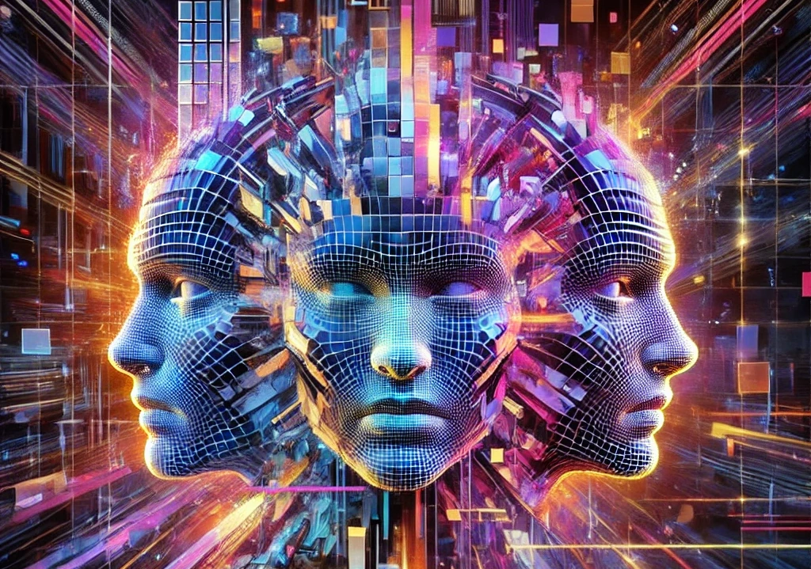

# Managai: Manage Multi Agent AI

Managai is a demo for dynamic agent creation.  
One orchestrator agent takes the user command and spawns multiple agents with inferior models to execute single, simple tasks. At the end of the process flow, one agent will summarize and merge the input by the other agents.

The idea is that the orachestrator agent should answer with strictly valid JSON, which can then be interpreted by a agent flow engine to dynamically create the worker agents.

